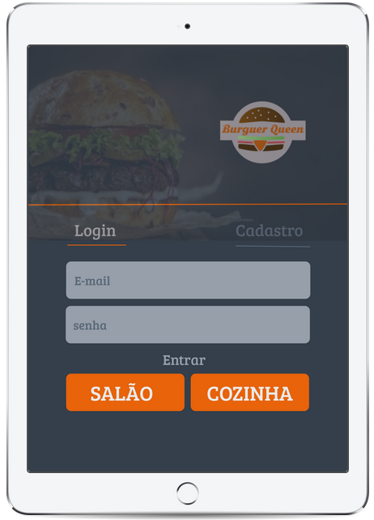

# Burger Queen

### Objetivo

Um pequeno restaurante de hambúrgueres, que está crescendo, necessita uma
interface em que se possa realizar pedidos utilizando um _tablet_, e enviá-los
para a cozinha para que sejam preparados.  


### Como funciona:

Para ter aceso as funcionalidades do produto é necessário realizar um cadastro, que pode ser realizado inserindo  nome, e-mail, senha e tipo de usuário.
Depois de logado o usuário pode visualizar a interface do salão ou cozinha de acordo com o seu perfil. O usuário do salão pode fazer pedidos e excluí-los,visualizar o resumo do pedido, o valor total, bem com visualizar o nome dos clientes que fizeram um pedido após finalizado.

---

### Protótipo:

- Marvel: https://marvelapp.com/3jj1ab2

---
## roadmap oficial do projeto

#### versão 1.1.0 (em desenvolvimento)

Funcionalidades:
- Visualizar pedidos de forma ordenada;
- alterar o estatus do pedido de realizado para pronto e entregue.

#### versão 1.0.0

Funcionalidades implementadas:
- Regristro de conta com nome, email e tipo de usuário;
- Login com email e senha;
- Visualizar a tela de salão e cozinha de acordo com o tipo de usuário logado; 
- Fazer pedidos; 
- Visualizar nome dos clientes com pedidos realizados.
- App: https://burger-queen-308e3.firebaseapp.com/



---

### Informações Técnicas

- Foi utilizado o Firebase para autenticação, banco de dados e armazenamento. 
- React, HTML5, CSS3, Bootstrap 4 e JavaScript para o desenvolvimento.

O firebase está lendo as informações na pasta Build (e não a pasta public, padrão do firebase), portanto para rodar o projeto na sua máquina é necesário usar os comandos:


   ```sh
   npm run build
   ```

   
   ```sh
   firebase serve
   ```


